# II-Raimon-Mejias-P03-Introduccion-Fisicas
Repositorio que contiene los scripts realizados y un README con la descripción del trabajo de la práctica

## Descripción del trabajo realizado

### Script 01

Se nos pide agregar un campo publico, velocidad, al cubo de la práctica anterior. Además se debe mostrar por consola el resultado de multiplicar los valores obtenidos de multiplicar la velocidad con en el eje vertical u horizontal, indicando que tecla se ha pulsado en cada momento. 

```C#
        string key = "";
        float speedAxis = 0.0f;
        if (Input.GetKey(KeyCode.LeftArrow) || Input.GetKey(KeyCode.RightArrow)) {
            key = Input.GetKey(KeyCode.LeftArrow)? "LeftArrow" : "RightArrow";
            speedAxis = speed * Input.GetAxis("Horizontal");
            Debug.Log($"{key}: {speedAxis}");
        }
        if (Input.GetKey(KeyCode.UpArrow) || Input.GetKey(KeyCode.DownArrow)) {
            key = Input.GetKey(KeyCode.UpArrow)? "UpArrow" : "DownArrow";
            speedAxis = speed * Input.GetAxis("Vertical");
             Debug.Log($"{key}: {speedAxis}");
        }
```

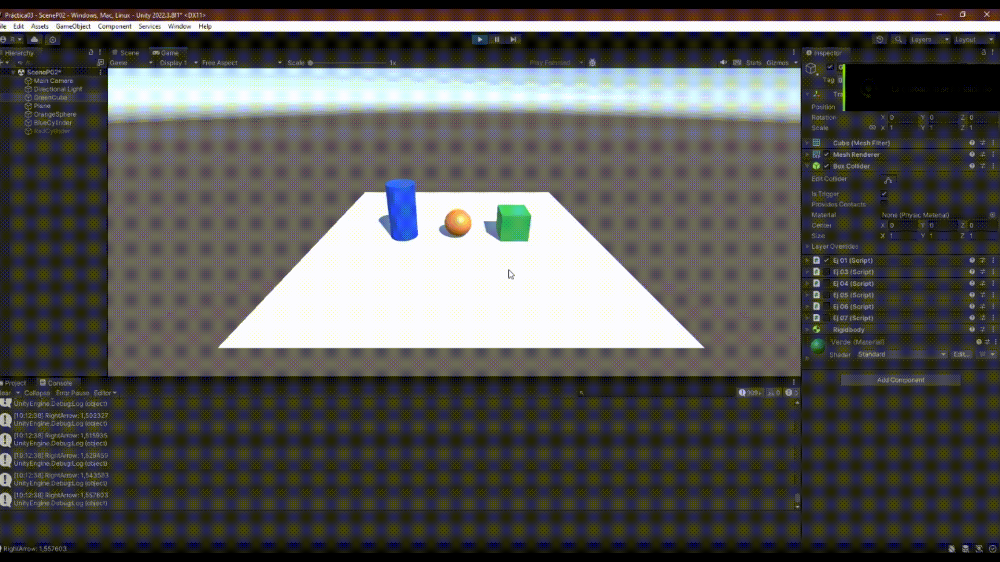


### Ejercicio 02

Se nos pide cambiar el la tecla de disparo de `ctrl left` a la tecla `H`.

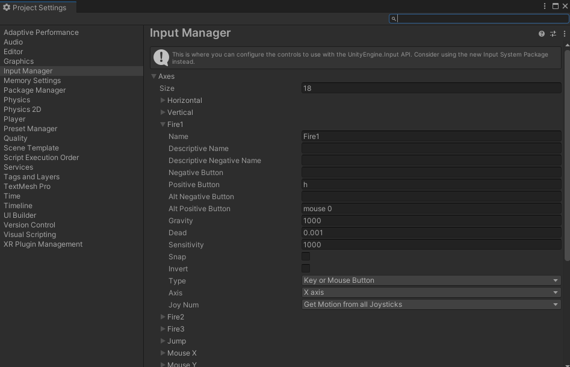

### Script 03

Se nos pide crear un script asociado al cubo en el cual se indican de manera publica un vector de moviimento y una velocidad, en cada frame el cubo se debe mover en dicha dirección con la velocidad indicada.

```C#
    void Update()
    {
        transform.Translate(moveDirection * speed * Time.deltaTime, Space.World);
    }
```

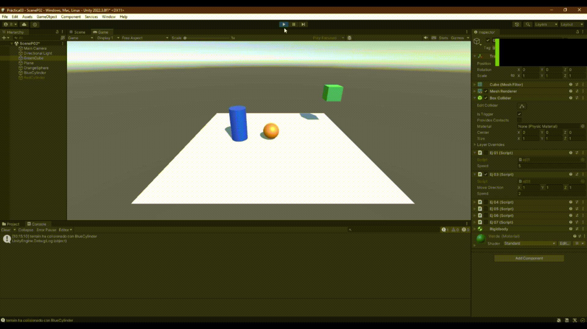

En este primer GIF se muestra el comportamiento normal del script, a continuación se realizarán una serie de cambios:

#### Duplicar las coordenadas de moveDirection:

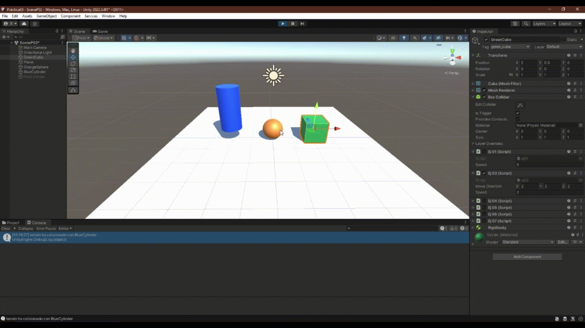

Se puede observar como el cubo se mueve el doble de rápido con respecto al comportamiento normal.

#### Duplicar la velocidad:

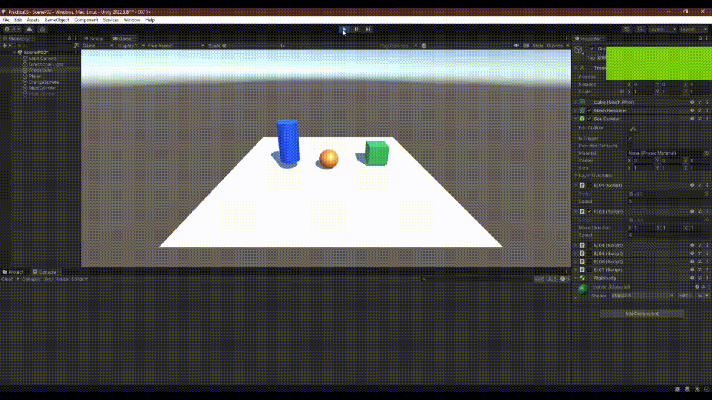

Se obtienen los mismos resultados observados al duplicar las coordenadas de moveDirection.

#### Velocidad menor a 1:

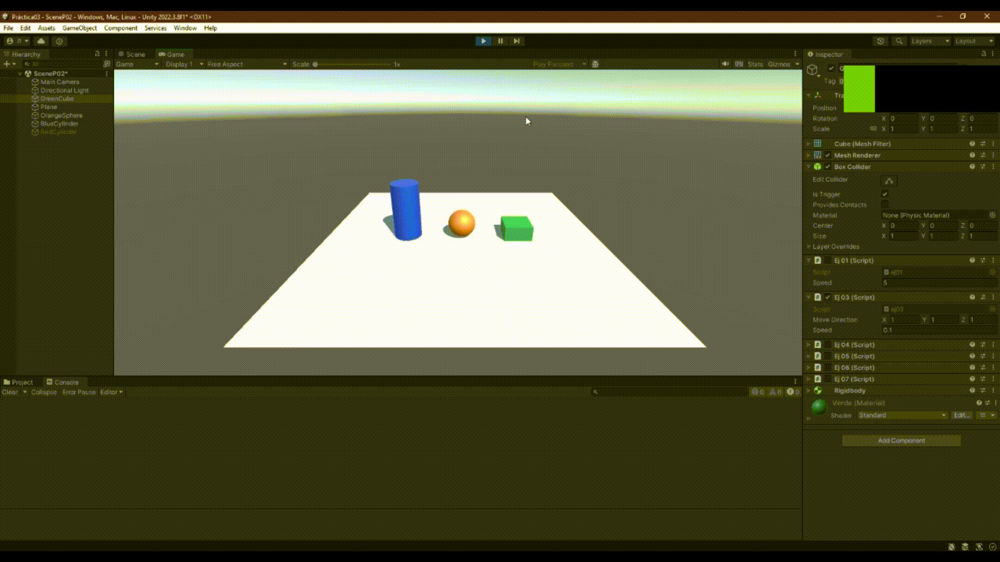

El cubo se moverá lentamente, en caso de utilizar números negativos el cubo irá en dirección contraria.

#### Cubo en altura mayor que 0:

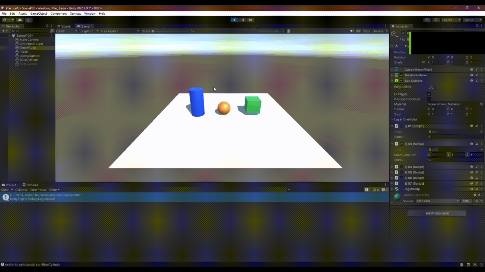

No hay cambios, el cubo se mueve en la dirección y velocidad seleccionadas, simplemente a una mayor altura.

#### Cambiar de movimiento relativo a movimiento global:

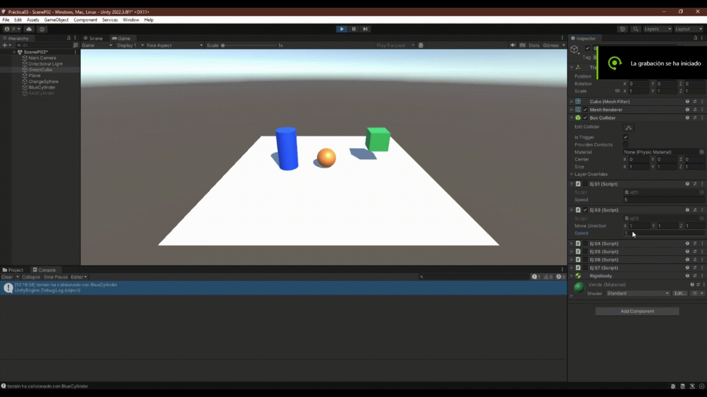

No hay cambios significativos.

### Script 04

Se nos pide realizar un script que mueva la esfera utilizando las teclas WASD y el cubo con las flechas.

```C#
    public float speed = 1.0f;
    public bool WASD = true;
    // Update is called once per frame
    void Update()
    {
        float horizontalMovement = 0.0f;
        float verticalMovement = 0.0f;
        float movement = 1.0f * speed;
        if (Input.GetKey((WASD)? KeyCode.A : KeyCode.LeftArrow)) { horizontalMovement = -movement; }
        if (Input.GetKey((WASD)? KeyCode.D : KeyCode.RightArrow)) { horizontalMovement = movement; }
        if (Input.GetKey((WASD)? KeyCode.W : KeyCode.UpArrow)) { verticalMovement = movement; }
        if (Input.GetKey((WASD)? KeyCode.S : KeyCode.DownArrow)) { verticalMovement = -movement; }
        transform.Translate(horizontalMovement, 0, verticalMovement);
    }
```

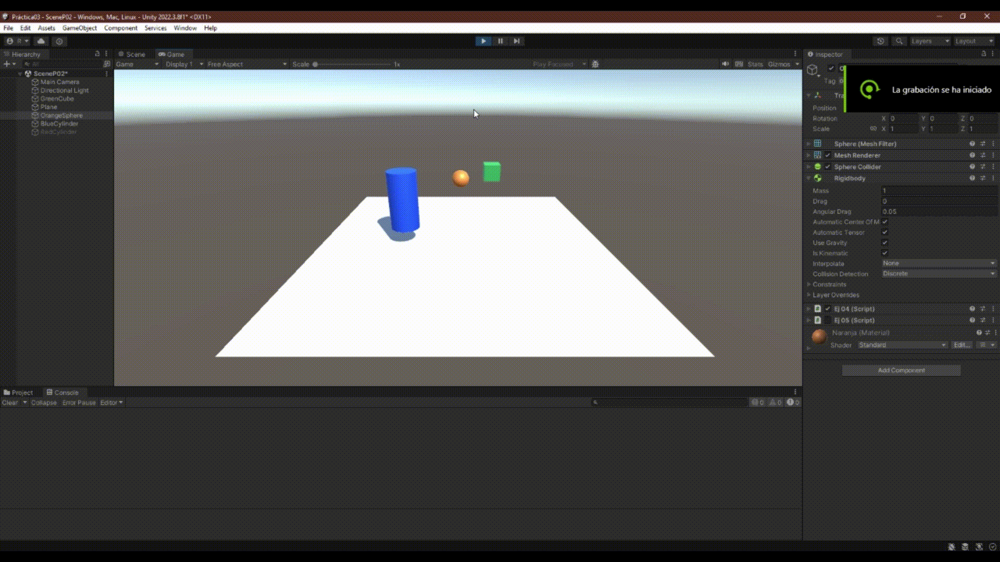

### Script 05

Se debe modificar el script anterior para que el movimiento de los objetos sea proporcional al tiempo transcurrido durante la generación del frame

```C#
        float movement = 1.0f * speed * Time.deltaTime; // Se le añade el Time.deltaTime
```

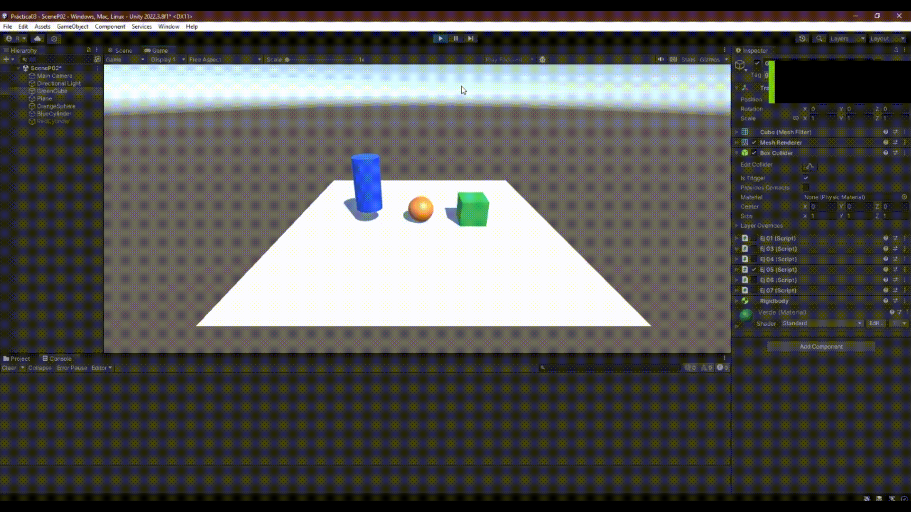

### Script 06

Con la idea de los scripts anteriores, ahora se nos pide realizar un script que mueva constantemente al cubo hacia la esfera.

```C#
    public float speed = 1.0f;
    public GameObject targetObject;
    void Update()
    {
        float distance = speed * Time.deltaTime;
        Vector3 targetPosition = targetObject.transform.position;
        Vector3 movement = (targetPosition - transform.position).normalized;
        transform.Translate(movement * distance);
    }
```

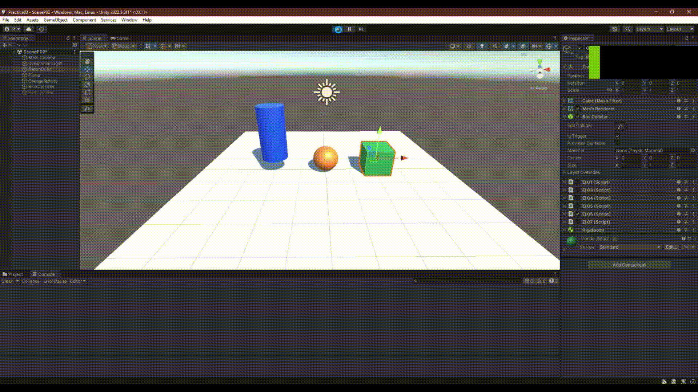

### Script 07

Modificar el Script 06 para hacer que el cubo gire en dirección a la esfera. Se añade la siguiente línea de código al script anterior.

```C#
  transform.LookAt(targetObject.transform);
```

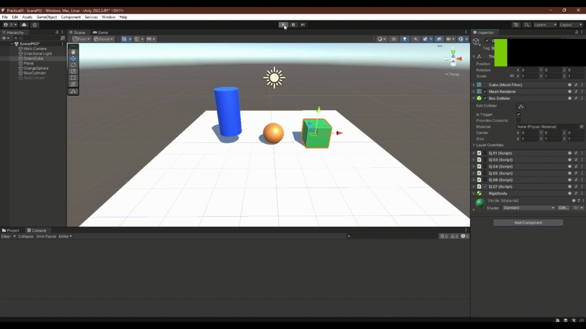

### Script 08

Se nos pide crear un nuevo Script que impulse a un objeto hacía delante, con el eje Horizontal se debe poder rotal al objeto.

```C#
    void Update()
    {
        float movement = speed * Time.deltaTime;
        transform.Rotate(transform.up * Input.GetAxis("Horizontal"), Space.World);
        transform.Translate(transform.forward * movement, Space.World);
        Debug.DrawRay(transform.position, transform.forward * 2 , Color.red);
    }
```


### Scripts 09 - 10 - 11

Para el Script 09 se nos pide configurar al cilindro como un objeto físico, cuando el cilindro colisione contra otro objeto este debe mostrar por consola la etiqueta del objeto contra el que colisionó.

```C#
    void OnCollisionEnter(Collision other) {
        Debug.Log($"{other.gameObject.tag} ha colisionado con {name}");
    }
```

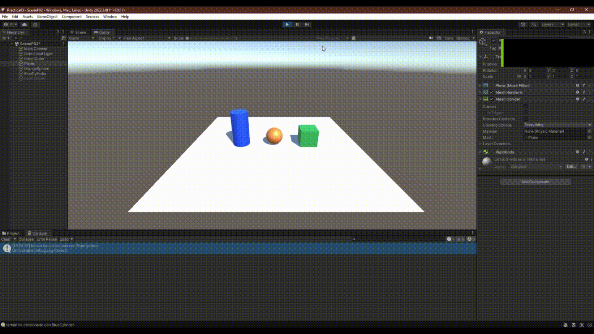

Para el Script 10 se nos pide configurar a la esfera como un objeto físico y al cubo como un objeto cinemático, el script no tiene que ser modificado.

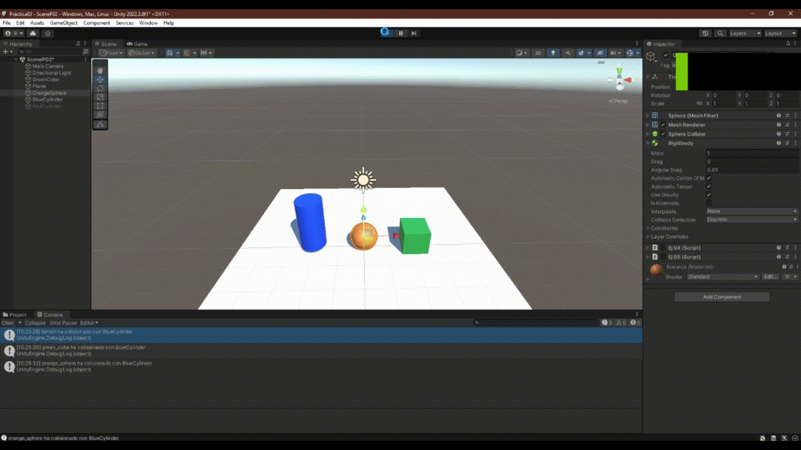

Para el Script 11 se nos pide que el cilindro sea de tipo Trigger, es necesario añadir en el código el comportamiento correspondiente al trigger.

```C#
    void OnTriggerStay(Collider other) {
        Debug.Log($"{other.gameObject.tag} esta colisionado con {name}");
    }
```

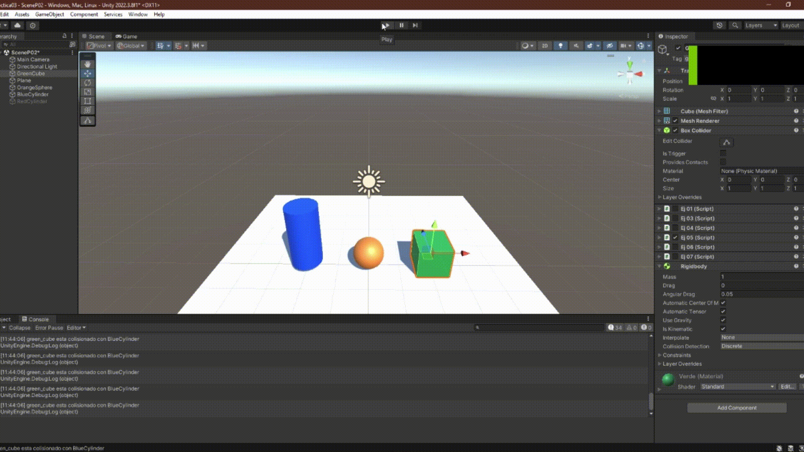

### Script 12

Se nos pide crear un nuevo cilindro al cual se le debe programar movimiento, pero a la vez debe ser un objeto físico, por lo cual se usa el AddFoce.

```C#
    void Update()
    {
       if (Input.GetKey(KeyCode.LeftArrow) || Input.GetKey(KeyCode.RightArrow)) {
            Vector3 movement = (Input.GetKey(KeyCode.LeftArrow)? Vector3.left : Vector3.right);
            GetComponent<Rigidbody>().AddForce(movement * speed * Time.deltaTime, ForceMode.Impulse);
        }
       if (Input.GetKey(KeyCode.UpArrow) || Input.GetKey(KeyCode.DownArrow)) {
            Vector3 movement = (Input.GetKey(KeyCode.UpArrow)? Vector3.forward : Vector3.back);
            GetComponent<Rigidbody>().AddForce(movement * speed * Time.deltaTime , ForceMode.Impulse);
        }
    }
```

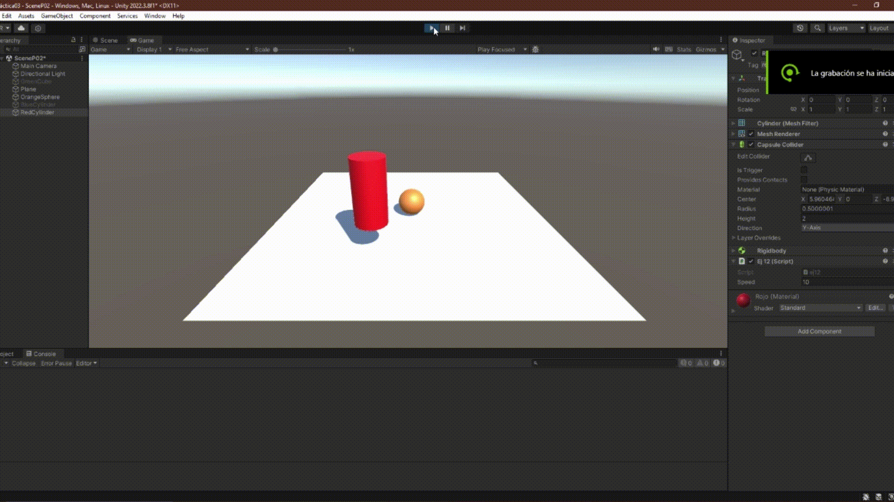

Tras esto se nos pide además comprobar el script con varias configuraciones:

#### Masa 10 veces superior:

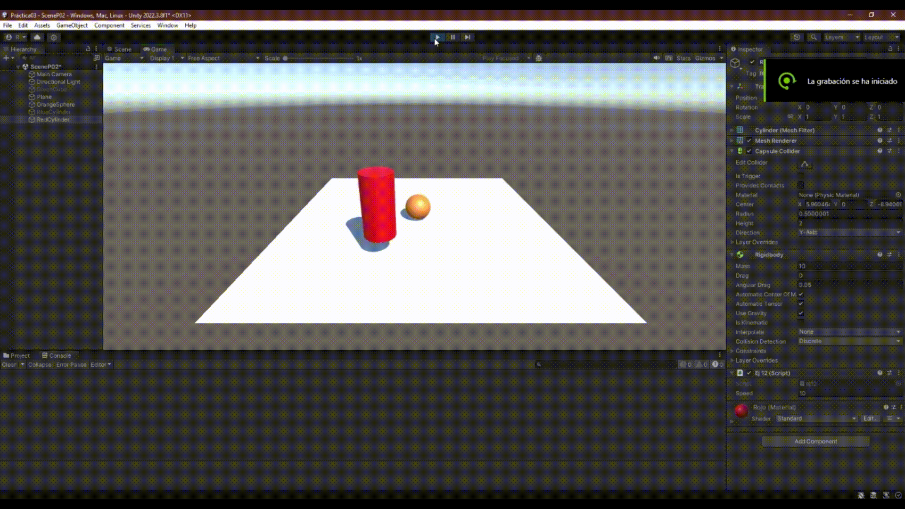

Se puede observar que el cilindro se mueve más lento que en el comportamiento original.

#### Masa 10 veces inferior:

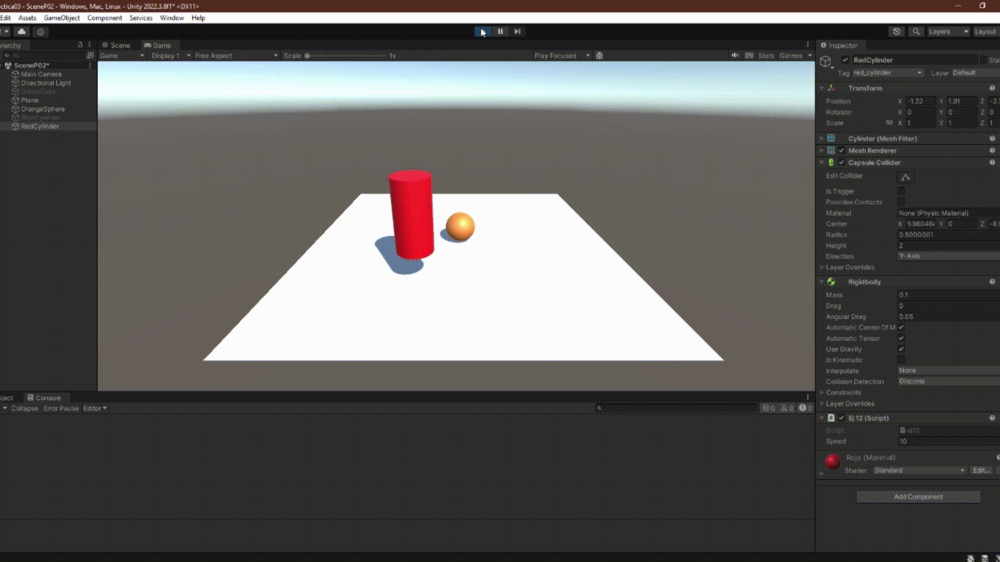

Se puede observar que el cilindro se mueve más rápido que en el comportamiento original.

#### comportamiento cinemático y tipo Trigger:

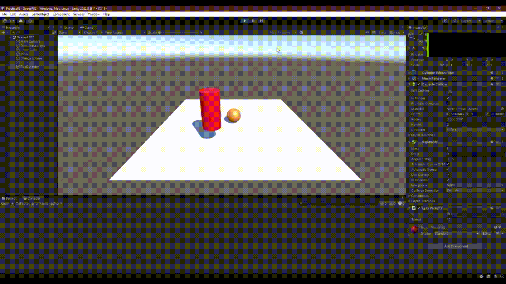

El cilindro, pese a tener el script de movimiento, este no recibe ningún impulso.


 
